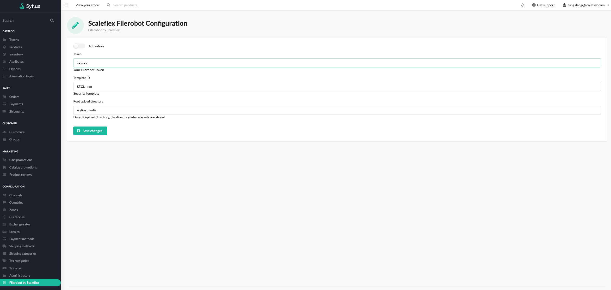

# Installation

### Step 1: Download the plugin
Open a command console, enter your project directory and execute the
following command to download the latest stable version of this bundle:

```shell
 composer require scaleflex/sylius-filerobot-plugin
```

This command requires you to have Composer [installed globally](https://getcomposer.org/doc/00-intro.md), as explained in the installation
chapter of the Composer documentation.

### Step 2: Enable the plugin
Then, enable the plugin by adding it to the list of registered
plugins/bundles in config/bundles.php file of your project:

```injectablephp
<?php

# config/bundles.php

return [
    // ...
    Scaleflex\SyliusFilerobotPlugin\ScaleflexSyliusFilerobotPlugin::class => ['all' => true],
];
```

### Step 3: Configure the plugin

#### Update DB Schema
```shell
bin/console doctrine:migration:diff
bin/console doctrine:migration:migrate
bin/console cache:clear
```

### Add Admin route
Create file in ```config/routes/scaleflex_sylius_filerobot.yaml``` and add content bellow

```yaml
# config/routes/scaleflex_sylius_filerobot.yaml
scaleflex_sylius_filerobot:
  resource: "@ScaleflexSyliusFilerobotPlugin/Resources/config/routing.yaml"
```

#### Update product media tab form
Change form theme ``````
in your ```templates/bundles/SyliusAdminBundle/Product/Tab/_media.html.twig```

```html


<div class="ui tab" data-tab="media">
  <h3 class="ui top attached header">{{ 'sylius.ui.media'|trans }}</h3>

  <div class="ui attached segment">
    {{ form_row(form.images, {'label': false}) }}

    {{ sylius_template_event(['sylius.admin.product.' ~ action ~ '.tab_media', 'sylius.admin.product.tab_media'], {'form': form}) }}
  </div>
</div>
```
#### Update product grid thumbnail
Change grid thumbnail column template
```yaml
# config/package/_sylius.yaml

sylius_grid:
  grids:
    sylius_admin_product:
      fields:
        image:
          options:
            template: "@ScaleflexSyliusFilerobotPlugin/Admin/Product/Grid/Field/image.html.twig"
```
#### Add script

```yaml
# config/package/sylius_ui.yaml

sylius_ui:
  events:
    sylius.admin.layout.javascripts:
      blocks:
        filerobot_script: '@ScaleflexSyliusFilerobotPlugin\Admin\filerobotScript.html.twig'
```

#### Add config filter
Create a file ```config/packages/scaleflex_filerobot.yaml``` and add content bellow
```yaml
imports:
  - { resource: "@ScaleflexSyliusFilerobotPlugin/Resources/config/filters.yaml"}
```
#### Update config in Admin
Goto **Scaleflex Filerobot** under **Configuration**


You can only enable if token, security template id are correct

- Activation: Enable/Disable Filerobot plugin
- Filerobot Token: Your Filerobot token
- Security Template Identifier: Your security template ID
- Filerobot upload directory: Folder path to your asset, ie /magento

#### Developer guide

The Filerobot plugin provide some twig method, filter support developer

- ```is_filerobot(image_path)```: Twig function check if image is filerobot
- ```image_path|filerobot('sylius_shop_product_thumbnail')```: Twig Filter, with image size, you can add more filter
in ```config/package/scaleflex_filerobot.yaml```

    ```yaml
    scaleflex_sylius_filerobot:
      filters:
        custom_size: { width: 120, height: 120 }
    
    ```
    and in Twig
    ```html
    image_path|filerobot('custom_size')
    ```
    
    We have some default size follow Sylius default, you can override it in filter config above
    
    ```yaml
    scaleflex_sylius_filerobot:
      filters:
        sylius_admin_product_large_thumbnail: { width: 550, height: 412 }
        sylius_admin_product_small_thumbnail: { width: 150, height: 112 }
        sylius_admin_product_tiny_thumbnail: { width: 64, height: 64 }
        sylius_admin_product_thumbnail: { width: 50, height: 50 }
        sylius_shop_product_tiny_thumbnail: { width: 64, height: 64 }
        sylius_shop_product_small_thumbnail: { width: 150, height: 112 }
        sylius_shop_product_thumbnail: { width: 260, height: 260 }
        sylius_shop_product_large_thumbnail: { width: 550, height: 412 }
        sylius_small: { width: 120, height: 120 }
    
    ```

- If you use Scaleflex Filerobot on existing File you have to check the path is filerobot or not, if not use the default way
#### Example with Sylius default

- ```templates/bundles/SyliusShopBundle/Product/_mainImage.html.twig```
```html

    
        
    
        
    

    
        
    
        
    

    



```

- ```templates/bundles/SyliusShopBundle/Product/Show/_mainImage.html.twig```

```html

    
    
        
        
    
        
        
    

    
    
        
        
    
        
        
    

    
    


<div data-product-image="{{ path }}" data-product-link="{{ original_path }}"></div>
<a href="{{ original_path }}" class="ui fluid image" data-lightbox="sylius-product-image">
    
</a>

<div class="ui divider"></div>

{{ sylius_template_event('sylius.shop.product.show.before_thumbnails', {'product': product}) }}

<div class="ui small images">
    
    
    <div class="ui image">
    
        
    
        <a href="{{ is_filerobot(image.path) ? image.path|filerobot('sylius_shop_product_original') : image.path|imagine_filter('sylius_shop_product_original') }}" data-lightbox="sylius-product-image">
            
        </a>
    </div>
    
</div>


```
